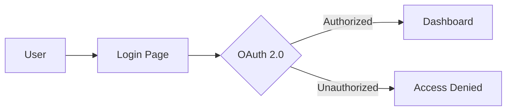

## What is the Trading Analysis Dashboard?

The Trading Analysis Dashboard is a Flask-based web application designed to track and analyze stock trading performance. It provides real-time portfolio management, historical trade analysis, and comprehensive reporting to help understand trading patterns and portfolio performance.

## Core Components

<AccordionGroup>
  <Accordion icon="chart-line" title="Portfolio Manager">
    Tracks current holdings including stocks, ETFs, and mutual funds with real-time price updates from Finnhub API. Displays allocation charts, performance metrics, and gain/loss analysis.
    
    **Key capabilities:**
    - Add/edit/delete holdings
    - Real-time price refresh
    - Allocation visualization
    - Performance tracking
  </Accordion>
  
  <Accordion icon="chart-bar" title="Trading Analysis Engine">
    Analyzes historical trading performance using a hybrid matching algorithm that combines broker-provided realized gains/losses with transaction history for broker-level accuracy.
    
    **Key capabilities:**
    - Monthly P&L breakdown
    - Trade-by-trade details
    - Win/loss ratios
    - Dividend tracking
  </Accordion>
  
  <Accordion icon="calendar" title="Timeframe Analysis">
    Allows custom date range analysis to compare trading performance across different periods and identify trends.
    
    **Key capabilities:**
    - Custom date ranges
    - Period comparison
    - Trend identification
    - Performance reports
  </Accordion>
  
  <Accordion icon="calendar-days" title="Trading Calendar">
    Visual calendar view showing daily trading activity with heat maps to quickly identify profitable and losing periods.
    
    **Key capabilities:**
    - Monthly calendar view
    - P&L heat mapping
    - Pattern recognition
    - Activity tracking
  </Accordion>
  
  <Accordion icon="file-csv" title="CSV Import System">
    Supports bulk data import via CSV files for both portfolio holdings and transaction history with drag-and-drop interface.
    
    **Key capabilities:**
    - Drag-and-drop upload
    - Real-time processing feedback
    - Upload history tracking
    - Format validation
  </Accordion>
</AccordionGroup>

## Application Flow

### User Authentication

The application uses Google OAuth 2.0 for secure authentication. Users must be authorized (configured in environment variables) to access the system. Each user's data is completely isolated.



### Data Structure

The application maintains three primary data entities:

| Entity | Description | Key Fields |
|--------|-------------|------------|
| **Users** | Authentication and profile | email, brokerage_account, google_id |
| **Holdings** | Current portfolio positions | symbol, shares, cost_basis, current_price |
| **Transactions** | Historical trading activity | symbol, action, shares, price, date |

### Hybrid Matching Algorithm

The trading analysis uses a sophisticated matching system:

1. **Broker Realized Gains/Losses** - Pre-calculated lot matches from broker statements provide definitive P/L for closed positions
2. **Transaction History** - Complete buy/sell transaction records for verification and detail
3. **Hybrid Approach** - Combines both sources to achieve broker-level accuracy while maintaining transaction-level detail

See [Hybrid Matching](/features/hybrid-matching) for technical details.

## API Architecture

The application exposes a RESTful API with the following endpoint categories:

<CardGroup cols={2}>
  <Card title="Trading Data" icon="chart-line" href="/api-reference/months">
    Access monthly trading data, individual trades, and P/L information
  </Card>
  <Card title="Portfolio" icon="briefcase" href="/api-reference/portfolio-holdings">
    Manage holdings and trigger price refresh operations
  </Card>
  <Card title="Authentication" icon="lock" href="/api-reference/auth">
    OAuth endpoints and session management
  </Card>
  <Card title="Timeframe Analysis" icon="calendar" href="/api-reference/timeframe">
    Query performance across custom date ranges
  </Card>
</CardGroup>

## Technology Stack

### Backend
- **Flask** - Python web framework handling routing, templating, and business logic
- **SQLAlchemy** - ORM for database operations
- **PostgreSQL** - Relational database for data persistence
- **Flask-Dance** - OAuth integration for Google authentication

### Frontend
- **Bootstrap 5** - Responsive UI framework
- **Chart.js** - Interactive charts and visualizations
- **jQuery** - DOM manipulation and AJAX requests
- **DataTables** - Enhanced table functionality

### External Services
- **Finnhub API** - Real-time stock price data
- **Google OAuth 2.0** - User authentication

## Data Models

### Portfolio Holdings

```python
class Holding:
    id: int
    user_id: int
    symbol: str
    shares: float
    average_cost: float
    type: str  # stock, etf, mutual_fund
    current_price: float
    last_updated: datetime
```

### Trading Transactions

```python
class Transaction:
    id: int
    user_id: int
    symbol: str
    action: str  # buy, sell
    shares: int
    price: float
    date: datetime
    account_number: str
```

### Realized Gains

```python
class RealizedGain:
    id: int
    user_id: int
    symbol: str
    date_acquired: datetime
    date_sold: datetime
    proceeds: float
    cost_basis: float
    gain_loss: float
```

## Configuration

The application is configured via environment variables:

| Variable | Purpose |
|----------|---------|
| `FINNHUB_API_KEY` | API key for price data |
| `GOOGLE_CLIENT_ID` | OAuth client ID |
| `GOOGLE_CLIENT_SECRET` | OAuth client secret |
| `AUTHORIZED_USERS` | Comma-separated email list |
| `FLASK_SECRET_KEY` | Session encryption key |
| `DATABASE_URL` | PostgreSQL connection string |

## Features Deep Dive

<CardGroup cols={2}>
  <Card title="Portfolio Management" icon="chart-pie" href="/features/portfolio-management">
    Learn about tracking holdings and price updates
  </Card>
  <Card title="Trading Analysis" icon="magnifying-glass-chart" href="/features/trading-analysis">
    Understand P&L calculations and reporting
  </Card>
  <Card title="CSV Upload" icon="file-csv" href="/features/csv-upload">
    Import data from your broker
  </Card>
  <Card title="Hybrid Matching" icon="shuffle" href="/features/hybrid-matching">
    How the matching algorithm works
  </Card>
</CardGroup>
